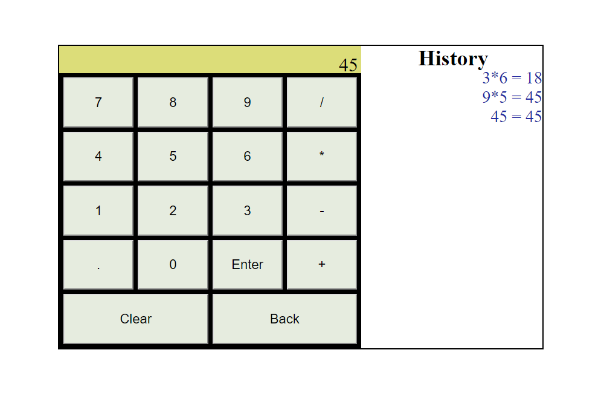

# Calculator

## Description

> A simple calculator that can do basic math operations and store them in history.

## Timeline

> January 15, 2019 - January 16, 2019

## Technology

> * HTML
> * CSS
> * Javascript

## What I learned

> * Javascript
> * Dom Manipulation
> * How to import Javascript into HTML to make interactive websites

## Page

### Main

